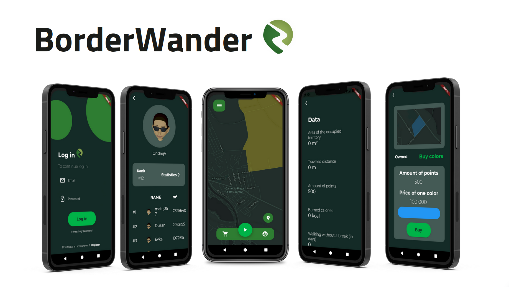
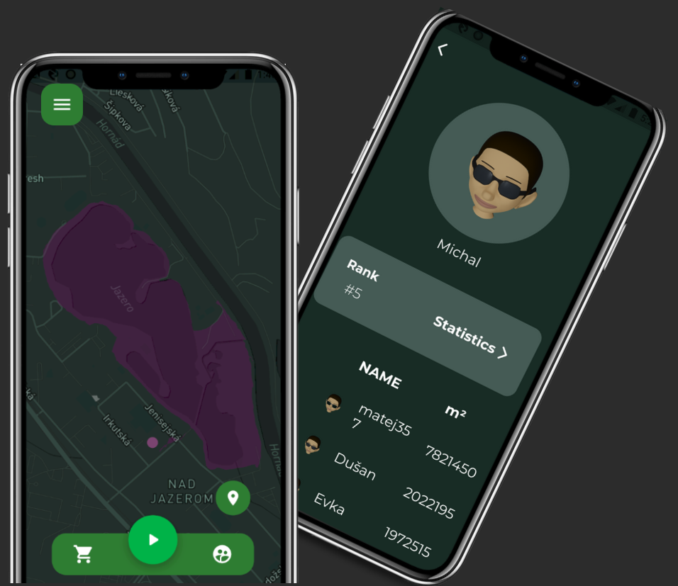

# BorderWander - a gamified approach to walking 

This conference winning application was created as a part of 2021 FLL competition. 

## About project
The ambition of this project was to create an application that not only help to creates the habit of regular walking but also transforms it into an engaging experience. Users stake their claim on real-world territory through their daily walks. The territories are captured by creating a convex shapes by walking. They are rewarded by points as well as the part of map that belongs to them. However, users can conquer each other's territories by walking over them. Our solution leverages the inherent human drive for competition and rivalry, turning it into a powerful motivator for regular app engagement. 

BorderWander doesn't stop at gamification; it offers users a wealth of insightful statistics, including captured territory, distance traveled, points earned, calories burned, and leaderboard rankings. Additionally, users can personalize their experience with buyable colors and character personalization.

## Demo

## Authors

The project was a result of a team effort. Our team contained several testers, one UI designer and two programmers.

## Features

- Light/dark mode map
- Dynamic map using Mapbox API
- Various custamization options
- Firebase integration for authentification and data storage
- Leaderboards

## Used Technologies

> (BorderWander is no longer in development)

BorderWander was fully built using Flutter and Dart. 
Cloud services such as authentification, and users data storage are provided by Firebase. The holy grail of applicatin is the real-time map of all territories. To achieve this, we utilitize Mapbox API.
## Run Locally

Althought the application is no longer in developmen, working version is accessible at: https://borderwander.github.io/
