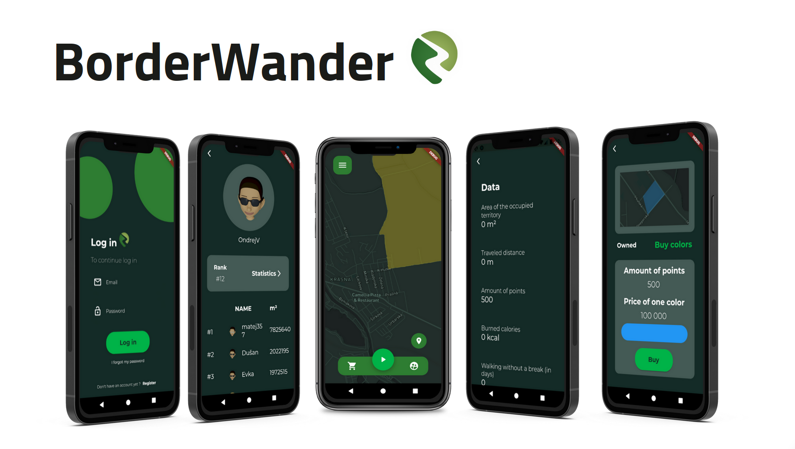
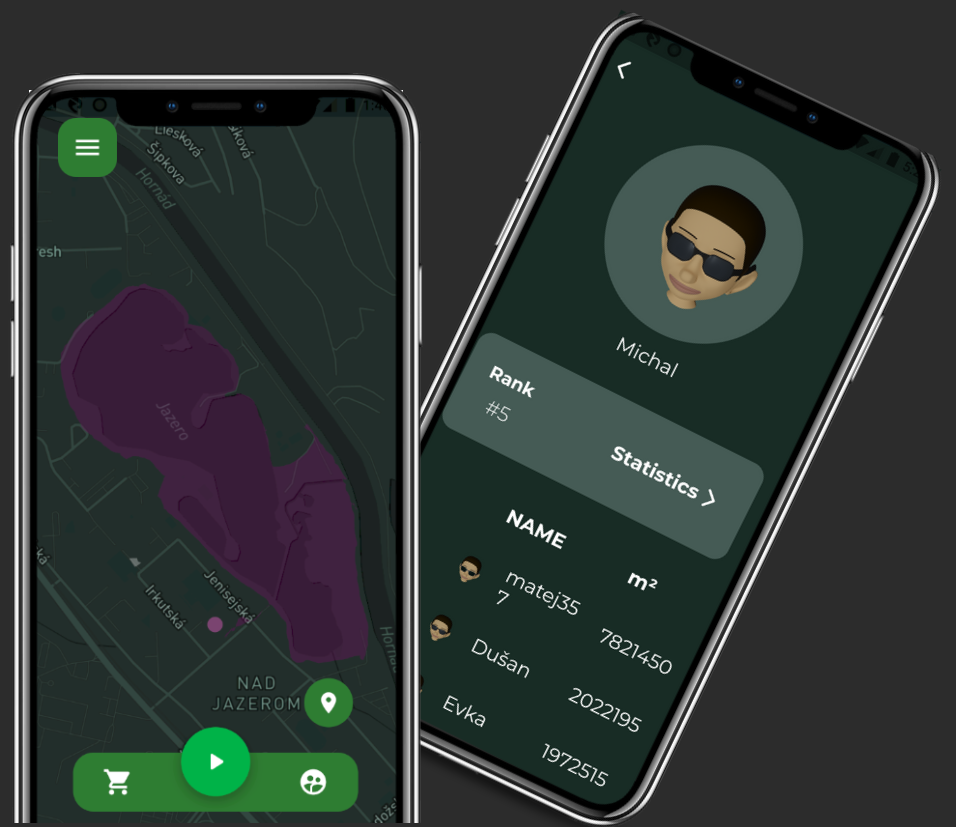

# BorderWander - a gamified approach to walking 

This conference-winning application was created as a part of the 2021 FLL competition. 

## About project
The ambition of this project was to create an application that not only helps to create the habit of regular walking but also transforms it into an engaging experience. Users get to claim real-world territory with each daily walk, forming unique shapes as they go. These territories earn them points and a piece of the map to call their own. Yet, there's also a friendly competition element – users can challenge each other by walking over their territories. Our solution leverages the inherent human drive for competition and rivalry, turning it into a powerful motivator for regular app engagement. 

BorderWander doesn't stop at gamification; it offers users statistics including captured territory, distance travelled, points earned, calories burned, and leaderboard rankings. In addition, users can personalize their experience with buyable colours and character personalization.

## Demo

  

## Authors
The project was a result of a team effort. Our team contained several testers, one UI designer and two programmers.

## Achievements
- 2021: 3. Place, Junior Internet conferrence (https://www.juniorinternet.sk/cms/vysledky-sutaze-junior-internet-amavet-2021/)
- 2021: Award of the Dean of the Faculty of Natural Sciences UPJŠ Košice

  

## Features

- Light/dark mode map
- Dynamic map using Mapbox API
- Various customization options
- Firebase integration for authentification and data storage
- Leaderboards

## Used Technologies

> (BorderWander is no longer in development)

* BorderWander was fully built using Flutter and Dart. 
* Integration with Firebase for authentification, and user data storage  
* The real-time map of all territories is achieved using Mapbox API.

## Run Locally
Although the application is no longer developing, the working version is accessible: https://borderwander.github.io/.
